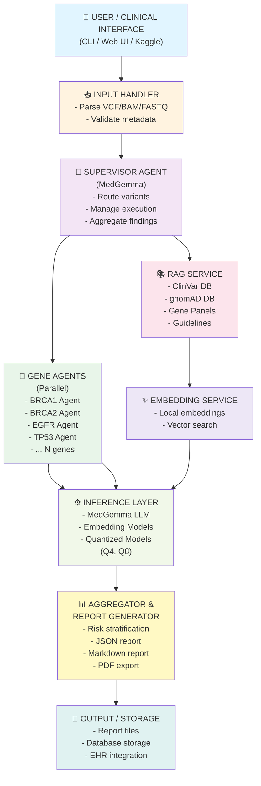
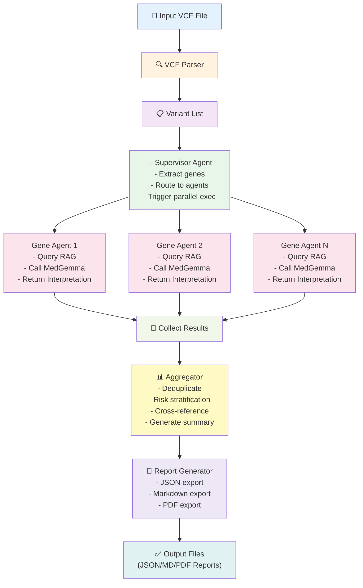

# Project Structure & Architecture

## Directory Layout

```
medAi_google/
├── README.md                          # Main project documentation
├── ARCHITECTURE.md                    # This file - detailed technical architecture
├── requirements.txt                   # Python dependencies
├── 
├── notebooks/
│   └── exploration_and_demo.ipynb     # Learning & experimentation notebook
│                                       # Contains: VCF parser, agents, report generator
│
├── src/
│   ├── __init__.py
│   ├── main.py                        # Entry point for production application
│   ├── config.py                      # Configuration settings
│   │
│   ├── parsing/
│   │   ├── vcf_parser.py              # Optimized VCF parsing
│   │   ├── bam_parser.py              # BAM file support (future)
│   │   └── fastq_parser.py            # FASTQ support (future)
│   │
│   ├── agents/
│   │   ├── base_agent.py              # Abstract base agent class
│   │   ├── gene_agent.py              # Specialized gene interpretation agents
│   │   ├── supervisor_agent.py        # Orchestration agent
│   │   └── rag_agent.py               # RAG-powered context retrieval
│   │
│   ├── inference/
│   │   ├── medgemma_interface.py      # MedGemma LLM integration
│   │   ├── embedding_service.py       # Embedding model service
│   │   └── local_llm.py               # Local model loading & inference
│   │
│   ├── rag/
│   │   ├── knowledge_base.py          # Knowledge base management
│   │   ├── database.py                # ChromaDB/FAISS integration
│   │   └── data/
│   │       ├── clinvar_subset.json    # ClinVar data (subset)
│   │       ├── gene_panels.json       # Cancer gene panels (NCCN, CGC)
│   │       └── guidelines.json        # Clinical guidelines
│   │
│   ├── report/
│   │   ├── report_generator.py        # Report creation (JSON, Markdown, PDF)
│   │   ├── templates/
│   │   │   ├── clinical_report.jinja2 # Jinja2 template
│   │   │   └── summary_template.jinja2
│   │   └── schema.py                  # Report data models (Pydantic)
│   │
│   └── utils/
│       ├── logging.py                 # Logger setup
│       ├── constants.py               # Gene lists, ACMG criteria, etc.
│       └── helpers.py                 # Utility functions
│
├── data/
│   ├── sample/
│   │   └── sample_001.vcf             # Example VCF for testing
│   ├── models/
│   │   └── medgemma/                  # Local MedGemma model (downloaded)
│   └── cache/
│       └── embeddings/                # Cached embeddings for RAG
│
├── tests/
│   ├── test_parsers.py                # Unit tests for VCF/BAM parsing
│   ├── test_agents.py                 # Agent logic tests
│   ├── test_report_generation.py      # Report generation tests
│   └── fixtures/
│       └── sample_vcf_data.py         # Test data
│
├── scripts/
│   ├── download_medgemma.py           # Download MedGemma model
│   ├── setup_rag.py                   # Initialize RAG database
│   └── benchmark.py                   # Performance testing script
│
└── docs/
    ├── SETUP.md                       # Installation & environment setup
    ├── USAGE.md                       # How to run the application
    ├── API.md                         # Agent API documentation
    └── RAG_DESIGN.md                  # RAG system design details
```

## Architecture Diagram



## Data Flow

### Pipeline Execution



## Technology Choices

### Why These Tools?

| Component | Choice | Rationale |
|-----------|--------|-----------|
| **LLM** | MedGemma | Medical pretraining, runs locally, Kaggle-native |
| **Agent Framework** | LangChain + AutoGen | Multi-agent orchestration, well-documented |
| **VCF Parsing** | PyVCF + Pysam | Industry standard, efficient |
| **Embeddings** | sentence-transformers | Local, no API calls, good medical domain performance |
| **Vector DB** | ChromaDB | Lightweight, pure Python, efficient for small-medium DBs |
| **Report Format** | Pydantic + Jinja2 | Type-safe data, flexible templating |
| **Python Version** | 3.9+ | Good balance of features, wide compatibility |

## Memory & Performance Estimates

### Local Execution Requirements

```
MedGemma LLM (quantized Q4):        ~8 GB
Vector embeddings (ChromaDB):       ~2 GB
Input/processing buffers:           ~2-4 GB
Python runtime + libraries:         ~2 GB
────────────────────────────────────────
Total Minimum:                      ~14-16 GB RAM
Comfortable threshold:              ~24 GB RAM
```

### Parallelization Strategy

- **Multi-threading** for I/O-bound operations (file reading, API calls)
- **Multi-processing** for CPU-intensive tasks (embedding generation)
- **Batch processing** for multiple samples
- **Async agents** for responsive CLI feedback

## Deployment Options

### Option 1: Local Desktop
- Single machine, 16GB+ RAM
- GPU optional (2-3x faster)
- Best for research/development

### Option 2: Server/Workstation
- Shared resource pool
- Batch processing multiple samples
- Persistent data store

### Option 3: Kaggle Notebook
- GPU enabled (TPU optional)
- Pre-configured environment
- Easy model upload
- Good for hackathon submission

### Option 4: Docker Container
- Consistent environment
- Easy deployment
- Resource limits configurable

## Security & Privacy Considerations

✅ **Offline-first** - No data leaves the system
✅ **No API calls** - All processing local
✅ **HIPAA-friendly** - Suitable for regulated healthcare
✅ **Auditable** - All decisions traceable
✅ **Open source** - Transparent and reviewable

## Next Steps (Priority Order)

### Phase 1: Core (Weeks 1-2)
1. ✅ Prototype design (done in notebook)
2. Refactor into modular src/ structure
3. Implement real MedGemma integration
4. Setup basic RAG with sample data

### Phase 2: Enhancement (Weeks 3-4)
5. Expand gene panel (50+ genes)
6. Add PDF report generation
7. Performance optimization
8. Error handling & validation

### Phase 3: Submission (Week 5)
9. Kaggle notebook conversion
10. Benchmark against standards
11. Documentation completion
12. Final testing & submission

